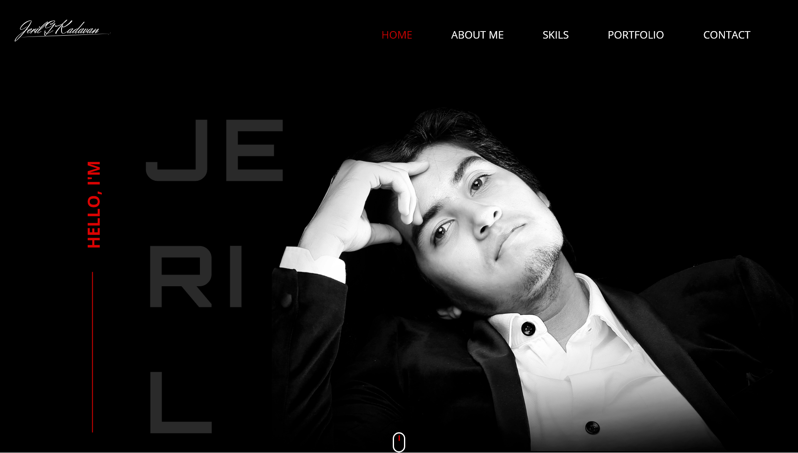

# Kadavan_jeril_Portfolio
My Portfolio

- https://jerilgkadavan.com

### Project Outline

The Portfolio in front of you represents who I am and what specific tasks I manage to execute designs as per the requirements. Well, I am a passionate creative Web Designer who enjoys enhancing technical skills which can be used to help people effectively. This portfolio illustrates the advanced features I can manage. On the vertical scrolling web page, you will find my works included and at the bottom of the portfolio, you will see the social media links where you can contact me for further information related to projects. 

Tools used during development phase:

- Photoshop
- Adobe Illustrator
- PHP/MySQL
- Gulp.js
- SASS
- Javascript Fetch API, to get data from backend databased
- Fonts: Orbitron and Open Sans
- https://greensock.com/ to animate data.
- http://imakewebthings.com/waypoints/ to animate elements on scroll.

### Giving credits for places that helped to do this project

- http://imakewebthings.com/waypoints/
- https://greensock.com/
- https://sass-lang.com/

### Future Improvements

-Backend and Database to be expanded
- Animations improvements
- Further refactoring SASS structure
- Include more data
- Updating data
